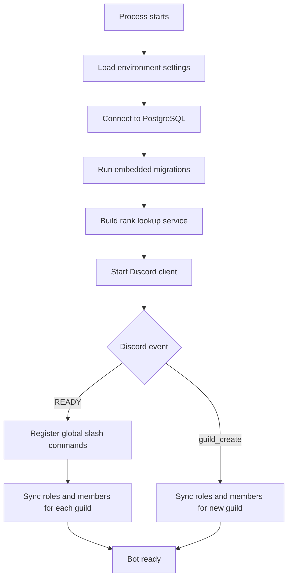
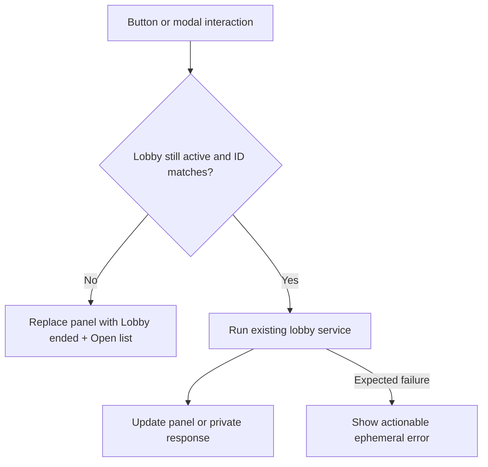
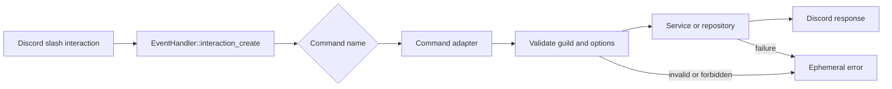
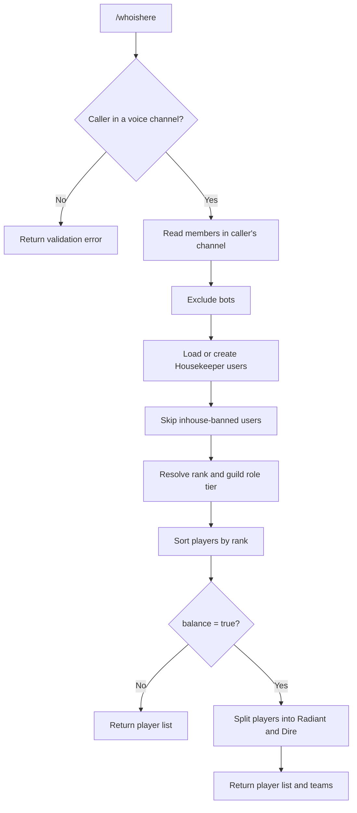
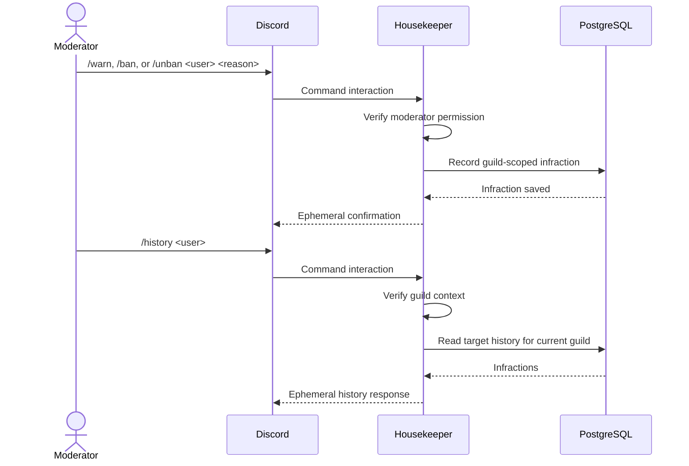
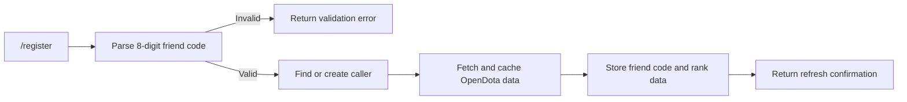
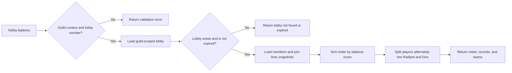
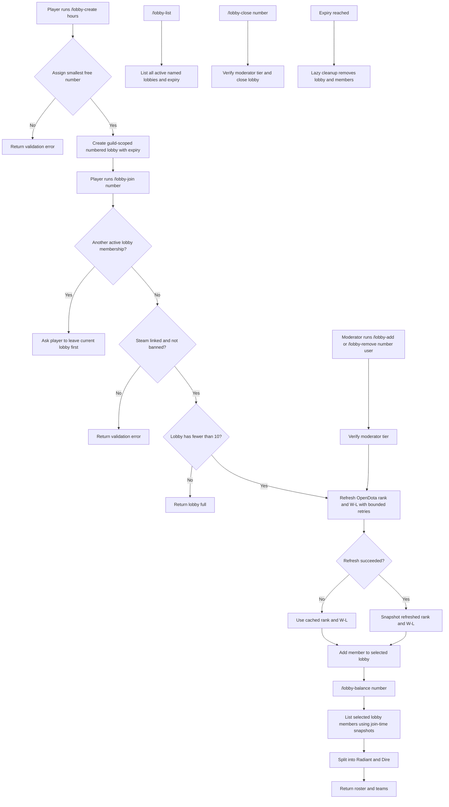

# Housekeeper workflows

This document describes how Housekeeper starts, registers commands, synchronizes guild state, and handles the main user workflows. The diagrams use Mermaid and can be rendered by GitHub and other Markdown viewers that support Mermaid.

## Startup and guild synchronization

The bot applies embedded SQLx migrations before connecting to Discord. When Discord sends `READY`, Housekeeper registers the global slash-command surface and synchronizes every guild in the event payload. If `DISCORD_COMMAND_GUILD_ID` is set, the same commands are also registered in that guild so they update immediately during development. A guild joined while the process is running follows the same synchronization path through `guild_create`.



Global command registration means command changes are shared by all guilds, although Discord may take time to propagate them. Set `DISCORD_COMMAND_GUILD_ID` during development to register an additional immediate guild-scoped copy without removing the global commands. Database rows that represent guild configuration are always resolved using the current Discord guild ID.

## Interactive panels

`/housekeeper` opens a private, per-user button hub with parity for the main voice and lobby workflows: `Who is here`, lobby list, current lobby, create lobby, Steam linking, and help. Navigation cannot overwrite another user's hub. Shared lobby and voice views are posted publicly like their slash-command equivalents; the in-memory panel registry reuses the existing message for the same lobby/list/user in the same channel and recreates it if the message was deleted. Lobby panels use buttons for joining, leaving, balancing, refreshing, and moderator management; select menus choose players and a modal collects Steam friend codes. Each lobby control carries both the lobby number and database ID. Before acting, the bot verifies that the lobby is still active and that the ID still matches, so expired, closed, deleted, or reused-number panels become an ended-lobby message instead of affecting a different lobby.



## Command dispatch

Every slash command enters the same Discord interaction handler. The handler selects the command adapter by its name; the adapter validates command input and delegates domain work to repositories or services. Errors are returned as ephemeral Discord responses.



`/help` is read-only: it returns the command guide without accessing the database. Use it in Discord to see the current usage text.

## First-guild setup

A Discord Administrator or a member with a configured moderator tier can configure a guild. The normal first setup is to create at least one tier, then map one or more existing Discord roles to it. Use the `remove` subcommands to remove mappings or tiers. Removing a tier with mappings requires `confirm:true`; the database then cascade-deletes all mappings for that tier. Role and member synchronization keeps the cache used by authorization and rank display current.

```mermaid
sequenceDiagram
    actor Admin
    participant Discord
    participant Bot as Housekeeper
    participant DB as PostgreSQL

    Admin->>Discord: /admin-role-tier create <name> <moderator>
    Discord->>Bot: Command interaction
    Bot->>Bot: Verify Administrator or moderator tier
    Bot->>DB: Ensure guild exists
    Bot->>DB: Insert role tier
    DB-->>Bot: Tier created
    Bot-->>Discord: Ephemeral confirmation

    Admin->>Discord: /admin-role-map set <discord_role> <tier>
    Discord->>Bot: Command interaction
    Bot->>Bot: Verify role-manager permission
    Bot->>DB: Find tier in current guild
    Bot->>DB: Store role-to-tier mapping
    DB-->>Bot: Mapping saved
    Bot-->>Discord: Ephemeral confirmation

    Admin->>Discord: /admin-role-map remove <discord_role>
    Discord->>Bot: Command interaction
    Bot->>Bot: Verify role-manager permission
    Bot->>DB: Delete role-to-tier mapping
    DB-->>Bot: Mapping removed
    Bot-->>Discord: Ephemeral confirmation

    Admin->>Discord: /admin-role-tier remove <name> confirm:true
    Discord->>Bot: Command interaction
    Bot->>Bot: Verify role-manager permission and mapping count
    Bot->>DB: Delete tier; cascade-delete its mappings
    DB-->>Bot: Tier and mappings removed
    Bot-->>Discord: Ephemeral confirmation
```

## `/whoishere` and balanced teams

The command reads the caller's current voice channel from Discord's cache, excludes bots, and resolves each member's Housekeeper user and current guild role tier. The optional `balance` flag passes the displayed players to the balance service after sorting.



## Moderation workflow

Warnings, inhouse bans, and unbans are stored as guild-scoped infractions. The `ban` command changes Housekeeper's inhouse eligibility; it does not call Discord's server-ban API. The history command reads the same guild-scoped record set.



## Steam and rank refresh

`/register` accepts the caller's 8-digit Steam friend code, with or without a dash. The bot uses that numeric friend code as the OpenDota account identifier, refreshes cached Dota data, and stores the friend code. The API key is read from environment configuration and is never included in Discord responses.



## Concurrent numbered lobby workflow

`/whoishere` remains a quick scan of a voice channel and is separate from lobby membership. A guild can have multiple active lobbies at once. Each lobby has a unique positive number within that guild, holds at most 10 players, and expires automatically. Numbers are assigned by the bot using the smallest available number, so closed or expired numbers are reused. New lobbies default to a 12-hour lifetime and may be configured for 1–24 hours; moderators can close them early with `/lobby-close`.

Players create a lobby with `/lobby-create [hours]`, then join it with `/lobby-join <number>` using the number returned by the bot. A player may belong to only one active lobby in a guild, so attempting to join another lobby is rejected until they use `/lobby-leave`. `/lobby` accepts an optional number; without one, it displays the caller's current lobby. `/lobby-balance` displays a numbered lobby split into balanced Radiant and Dire teams. `/lobby-list` shows all active lobbies and their remaining lifetime.

A player must have linked Steam data and must not be inhouse-banned. Joining or being added refreshes the player's OpenDota rank and win/loss data so the lobby uses current data; a bounded retry policy handles rate limits and cached data is used if refresh ultimately fails. Moderators can use `/lobby-add <number> <user>` and `/lobby-remove <number> <user>` after permission verification. Expired lobbies are cleaned up lazily during lobby operations, and their memberships are removed by the database foreign-key cascade. A player can be in voice without being in any lobby, so spectators and other queues do not affect a lobby's teams.

### Lobby balance workflow

`/lobby-balance <number>` requires a numbered lobby and can only run in a guild. The bot loads the guild-scoped lobby and its membership snapshots, then displays each player's rank and win/loss record before splitting the roster into Radiant and Dire. Ranked players are scored by rank; unranked players receive a score estimated from their wins, losses, and game count. The sorted roster is distributed alternately between the two teams, so the command reports the current lobby roster and the resulting teams without changing membership.




